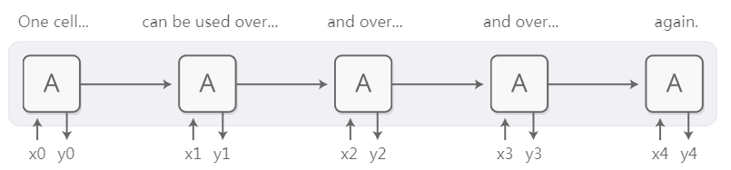
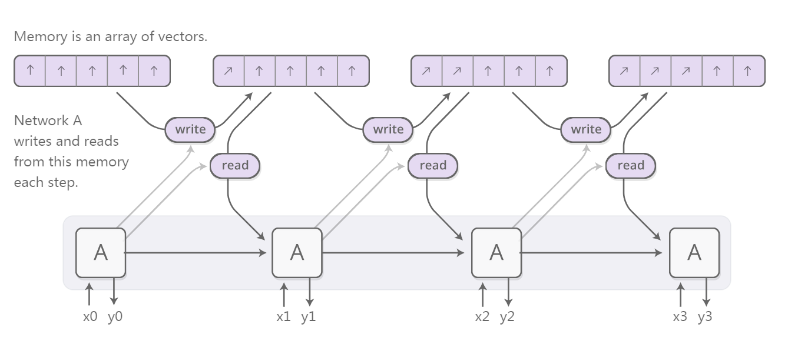
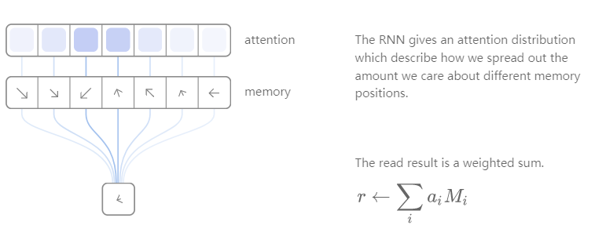
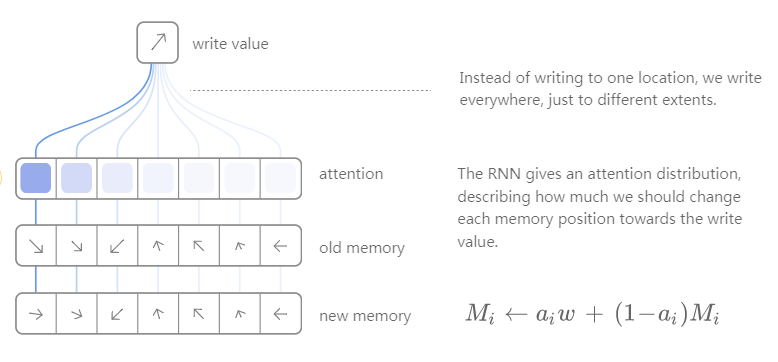

# Lstm中的Attention 机制
递归神经网络是深度学习的主要部分之一，神经网络可以处理文本，音频和视频等数据序列。它们可以对序列有着更深的理解，对序列进行注释，甚至可以从头开始生成新的序列！

普通的RNN难以处理很长的序列，但之前学习的LSTM神经元具有处理长序列的能力。它处理在包括翻译，语音识别和图像字幕在内的许多任务中取得了显着的结果。因此，在过去的几年中，递归神经网络已经变得非常普遍。当发生这种情况时，我们已经看到越来越多的尝试用新的属性来增加RNN。下面四个方向特别有趣：

##### Neural Turing Mahines

神经图灵机结合了RNN和外部存储库。由于矢量是神经网络的自然语言，所以记忆是一组矢量：

这种RNN使用一个外部内存库，存储着向量数组。但是write和read是如何工作的？我们想让它们变得可区分是有一定难度的。特别是，我们希望使它们与我们读取或写入的位置相区别，以便我们可以学习读写的位置。这是棘手的，因为内存地址似乎是从根本上离散。 NTM采取了一个非常聪明的解决方案：每一步，他们都在不同程度上阅读和写作。

举个例子，首先我们来看一下read。 RNN输出一个“attention distribution”，用来描述我们如何分散我们关心的不同记忆位置的数量。如此，read操作的结果是加权和。

同样，我们每次写字也使用不同程度。attention distribution描述了我们在每个位置写了多少。我们这样做是通过将内存中新位置的值作为旧内存内容与写入值的凸性组合，两者之间的位置由注意权重决定。

但是NTM如何决定在记忆中的哪个位置集中注意力呢？他们实际上使用了两种不同方法的组合：基于内容的注意力和基于位置的注意力。基于内容的关注允许NTM搜索他们的记忆并专注于他们所寻找的地方，而基于位置的注意力允许记忆中的相对移动，从而使NTM循环。

##### Attention Interfaces
当我翻译一个句子时，我特别注意我正在翻译的这个词。当我录制录音时，我会仔细聆听我正在积极写下的片段。如果你问我描述我正在坐的房间，那么我会在我描述的那些物体上四处浏览。

神经网络可以使用注意力来实现这种相同的行为，并将注意力集中在所给出信息的一部分子集上。例如，RNN可以参与另一个RNN的输出。在每个时间步，它集中在另一个RNN的不同位置。

我们希望注意力是可以区分的，以便我们可以学习到哪里去关注。要做到这一点，我们使用神经图灵机使用的相同技巧：我们集中在各地，只是不同程度的。

